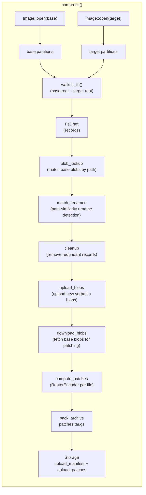
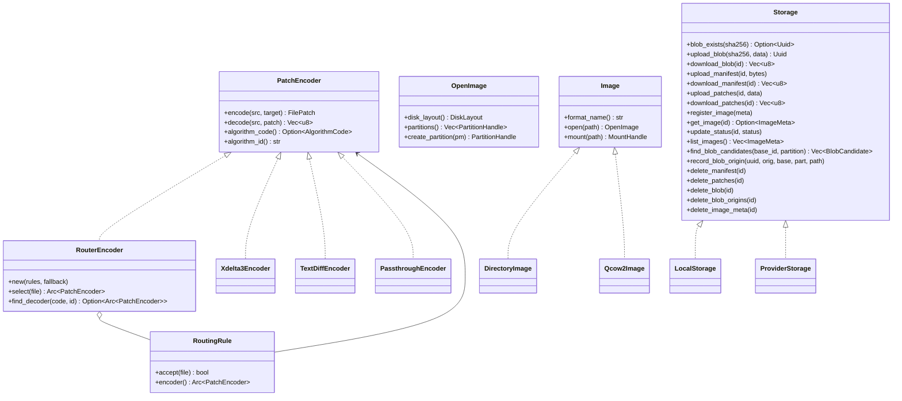
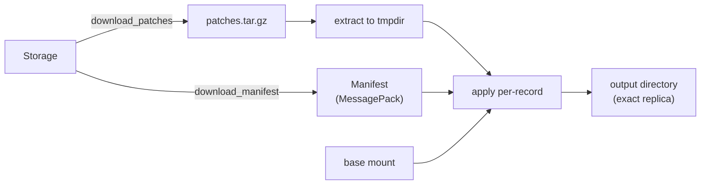
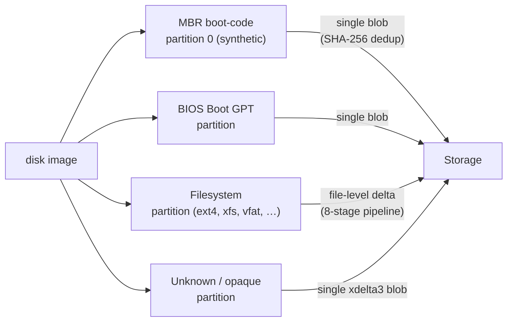

# Architecture

## Overview

imgdelta operates at the **filesystem level**, not the block-device level.
Instead of diffing raw disk images, it mounts both the base and target images,
walks their filesystem trees, detects per-file changes, and encodes each
changed file with the most appropriate algorithm.



<!-- TODO: turn this into a proper SVG -->

---

## Crates

| Crate                      | Type | Contains                                                               |
| -------------------------- | ---- | ---------------------------------------------------------------------- |
| `image-delta-core`         | lib  | All algorithms, traits, data structures, `LocalStorage` reference impl |
| `image-delta-cli`          | bin  | CLI binary, TOML config wiring, `LocalStorage` instantiation           |
| `image-delta-synthetic-fs` | lib  | Synthetic filesystem tree generator and mutator (test helper)          |

`image-delta-core` has zero dependency on any cloud SDK, database driver, or
HTTP framework. A provider embeds it directly and supplies their own `Storage`.

---

## Module map — `image-delta-core`

```
image-delta-core/src/
├── lib.rs                   pub re-exports; crate-level docs
├── error.rs                 Error enum, Result alias
├── manifest.rs              Manifest, PartitionManifest, Record, BlobRef,
│                            PatchRef, Patch, Data, Metadata  (MessagePack v4)
├── storage/
│   ├── mod.rs               Storage trait + BlobCandidate / ImageMeta / ImageStatus
│   └── local.rs             LocalStorage — filesystem-backed reference impl
├── image/
│   ├── mod.rs               Image trait + OpenImage trait
│   ├── directory.rs         DirectoryImage — plain directory (no mounting)
│   └── qcow2.rs             Qcow2Image — qemu-nbd mount (feature = "qcow2")
├── partitions/
│   ├── mod.rs               DiskScheme / PartitionKind / PartitionDescriptor / DiskLayout
│   ├── fs.rs                FsHandle + MountHandle + SimpleMountHandle
│   ├── mbr.rs               MbrHandle (MBR boot-code area)
│   ├── bios_boot.rs         BiosBootHandle (BIOS Boot GPT partition)
│   └── raw.rs               RawHandle (unknown / opaque partition)
├── encoding/
│   ├── mod.rs               PatchAlgorithm (internal), PatchEncoder trait,
│   │                        AlgorithmCode (u8), FileSnapshot, FilePatch
│   ├── router.rs            RouterEncoder, RoutingRule, FileInfo, GlobRule,
│   │                        ElfRule, SizeRule, MagicRule
│   ├── xdelta3/             Xdelta3Encoder (FFI to vendored xdelta3.c)
│   ├── text_diff.rs         TextDiffEncoder (Myers line-diff, pure Rust)
│   └── passthrough.rs       PassthroughEncoder (verbatim blob)
├── fs_diff/                 diff_dirs() → DiffResult, FileDiff, TreeStats
├── path_match/              find_best_matches() — bijective rename detection
├── compress/
│   ├── mod.rs               compress_fs_partition() entry point
│   └── partitions/
│       ├── fs/
│       │   ├── pipeline.rs  CompressPipeline — runs stages 2–7 in order
│       │   ├── stage.rs     CompressStage trait
│       │   ├── context.rs   StageContext (storage, router, image_id, …)
│       │   ├── draft.rs     FsDraft — mutable working state across stages
│       │   └── stages/
│       │       ├── walkdir.rs          Stage 1 — filesystem walk + SHA-256
│       │       ├── blob_lookup.rs      Stage 2 — match new files to base blobs
│       │       ├── match_renamed.rs    Stage 3 — rename detection
│       │       ├── cleanup.rs          Stage 4 — remove superseded records
│       │       ├── upload_blobs.rs     Stage 5 — upload verbatim blobs
│       │       ├── download_blobs.rs   Stage 6 — fetch base blobs for patching
│       │       ├── compute_patches.rs  Stage 7 — RouterEncoder per changed file
│       │       └── pack_archive.rs     Stage 8 — pack patches.tar + upload
│       ├── bios_boot.rs    BiosBootCompressor
│       ├── mbr.rs          MbrCompressor
│       └── raw_partition.rs RawPartitionCompressor
├── decompress/              Mirror of compress/ — stages for each record kind
└── operations/
    ├── compress.rs          compress() free function — full orchestrator
    ├── decompress.rs        decompress() free function — full orchestrator
    └── delete.rs            delete_image() — remove blobs + manifest
```

---

## Modularity

The design deliberately keeps every major concern behind a trait:



<!-- TODO: turn this into a proper SVG -->

None of these traits have dependencies on each other at the type level:

- A new **image format** implements `Image` (and `OpenImage`) — no changes to
  encoders or storage.
- A new **encoder** implements `PatchEncoder` — no changes to image format or
  storage.
- A new **storage backend** implements `Storage` — no changes to encoders or
  image format.
- The **router** is itself a `PatchEncoder`, so it can be used as the fallback
  of another router, enabling arbitrarily nested routing trees.

---

## Compression pipeline (stage-by-stage)

Each filesystem partition goes through an 8-stage sequential pipeline:

| Stage | Name              | What it does                                                                                                        |
| ----- | ----------------- | ------------------------------------------------------------------------------------------------------------------- |
| 1     | `walkdir`         | Walk base + target roots; compute SHA-256 per file; build initial `FsDraft` with only changed entries               |
| 2     | `blob_lookup`     | Query `Storage::find_blob_candidates` for the base image; match new files to existing base blobs by path similarity |
| 3     | `match_renamed`   | Detect renames using weighted edit-distance path scoring; upgrade matched records to delta candidates               |
| 4     | `cleanup`         | Remove records superseded by blob-lookup or rename matching                                                         |
| 5     | `upload_blobs`    | Upload remaining verbatim (LazyBlob) files to the blob store; record blob origin                                    |
| 6     | `download_blobs`  | Download base blobs needed as delta sources for changed files                                                       |
| 7     | `compute_patches` | Run `RouterEncoder::encode` per file; produce `PatchRef` records                                                    |
| 8     | `pack_archive`    | Pack all patches into `patches.tar.gz`; upload via `Storage::upload_patches`                                        |

Stages 2–7 are run by `CompressPipeline`; stage 8 is called directly after.

---

## Decompression pipeline

Decompression mirrors compression. For each partition the following stages run:

| Stage             | Records handled                                           |
| ----------------- | --------------------------------------------------------- |
| `extract_archive` | Download + extract `patches.tar.gz` to a temp directory   |
| `download_blobs`  | Fetch verbatim blobs for `Added` files                    |
| `copy_unchanged`  | Copy unchanged files from the base mount                  |
| `add_records`     | Write added files (from blobs) to output                  |
| `change_records`  | Apply patches to changed files                            |
| `rename_records`  | Copy renamed files from base and apply patches if any     |
| `delete_records`  | Skip removed files                                        |
| `apply_records`   | Set mode / uid / gid / mtime / xattrs on all output paths |

---

## Data flow — decompression



<!-- TODO: turn this into a proper SVG -->

---

## Manifest format

Manifests are serialised with **MessagePack** (`rmp-serde`, `to_vec_named`).
The current schema version is `4`.

```
Manifest {
    header: ManifestHeader {
        version:            u32          // MANIFEST_VERSION = 4
        image_id:           String
        base_image_id:      Option<String>
        format:             String       // "directory" | "qcow2" | …
        created_at:         u64          // Unix timestamp (seconds)
        patches_compressed: bool         // true → patches.tar.gz
    }
    disk_layout: DiskLayout {
        scheme: DiskScheme               // Gpt | Mbr | SingleFs
        partitions: Vec<PartitionDescriptor>
    }
    partitions: Vec<PartitionManifest> {
        descriptor: PartitionDescriptor
        content: PartitionContent        // Fs { records } | BiosBoot { blob_id }
                                         // | Raw { blob_id } | Mbr { blob_id }
    }
}
```

Each `Record` inside `Fs` content represents **one changed path** in the
filesystem. Unchanged files are absent from the manifest and taken directly
from the base image during decompression.

`None` / empty fields use `#[serde(skip_serializing_if)]` to keep the manifest
compact. A JSON debug view is available via `imgdelta manifest inspect --format json`.

---

## Partition types



<!-- TODO: turn this into a proper SVG -->

---

## Encoding strategy

| File type                                       | Default encoder      | Rationale                                |
| ----------------------------------------------- | -------------------- | ---------------------------------------- |
| ELF binaries (magic `\x7fELF`)                  | `xdelta3`            | VCDIFF handles binary similarity well    |
| Config / script files                           | `text_diff`          | Line-level diff is more compact for text |
| Already compressed (`*.gz`, `*.zst`, `*.xz`, …) | `passthrough`        | Re-encoding wastes CPU                   |
| Images / media                                  | `passthrough`        | Incompressible                           |
| Everything else                                 | `xdelta3` (fallback) | Safe default                             |

If a computed delta is larger than the source file
(`delta_size >= source_size * passthrough_threshold`), the patch is discarded
and the file is stored verbatim with `AlgorithmCode::Passthrough`. The
manifest records the actual algorithm so decompression is always symmetric.

`AlgorithmCode` is a one-byte tag stored in each `PatchRef`:

| Code   | Algorithm                                 |
| ------ | ----------------------------------------- |
| `0x00` | `Passthrough`                             |
| `0x01` | `Xdelta3`                                 |
| `0x02` | `TextDiff`                                |
| `0xFF` | `Extended` (algorithm id in string field) |

Codes `0x03–0xFE` are reserved for future built-in algorithms.
