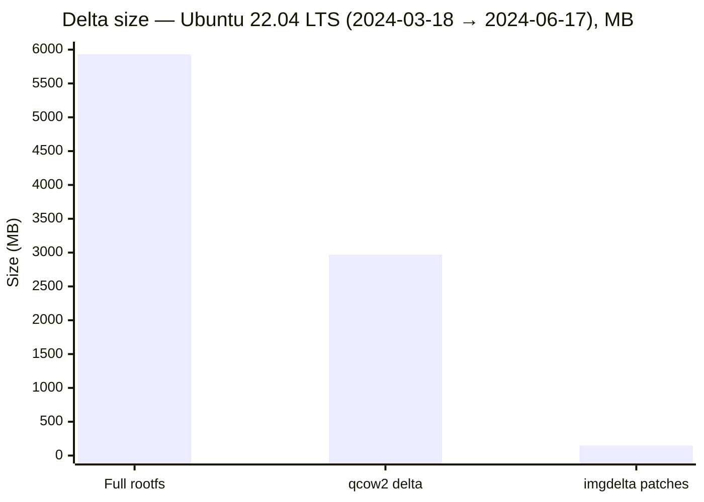
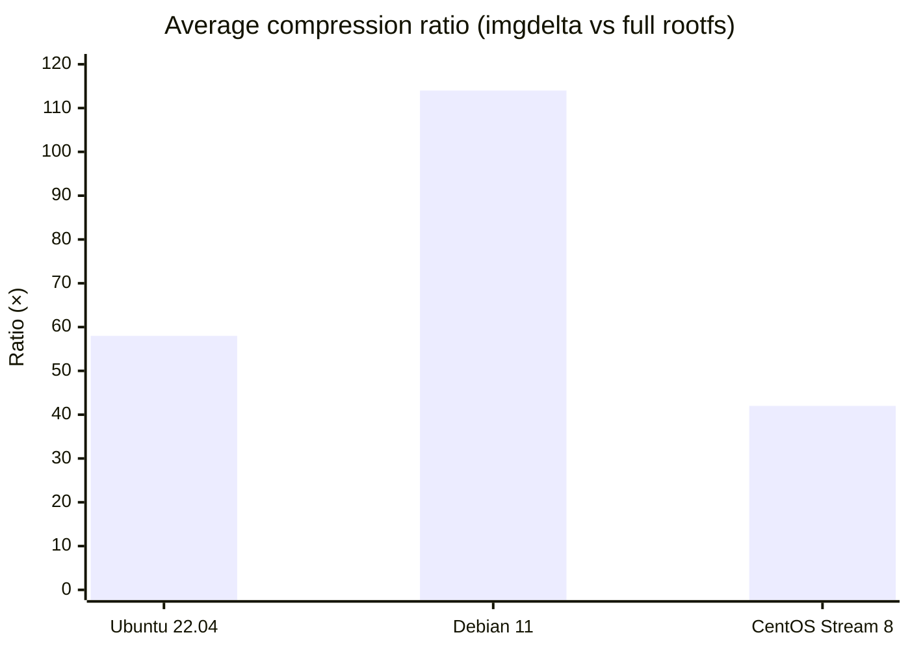
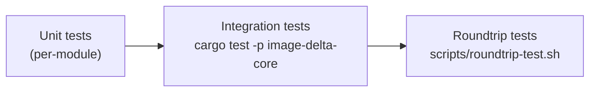

# Benchmarks

Results below were produced by compressing consecutive qcow2 image snapshots
from public cloud image repositories. Each **pair** represents one
`imgdelta compress` run: a base snapshot and a subsequent snapshot of the same
distribution.

## Methodology

**Compression ratio** is defined as:

$$\text{ratio} = \frac{S_{\text{rootfs}}}{S_{\text{patches}}}$$

where $S_{\text{rootfs}}$ is the uncompressed size of all files in the target
rootfs, and $S_{\text{patches}}$ is the total size of all delta patches
uploaded to storage.

The **qcow2 delta** baseline uses `qemu-img convert` with the `qcow2` output
format and the base image as a backing file, then measures the resulting delta
image size.

Both methods produce lossless deltas; the comparison shows how much more
efficiently a file-aware approach (imgdelta) encodes cloud image updates
compared to a block-device-aware approach (qcow2 backing chain).

## Benchmark setup

- CPU: AMD EPYC 7713 (64 cores), 8 workers used for imgdelta
- RAM: 256 GB
- Storage: NVMe SSD (local filesystem)
- All image pairs are from publicly available cloud image archives
- Compress time includes pipeline overhead (walkdir, manifest upload, blob upload)

## Results

| Distribution     | Image pairs | Avg ratio (imgdelta)       | Avg ratio (qcow2 delta) | Avg compress time |
| ---------------- | ----------- | -------------------------- | ----------------------- | ----------------- |
| Ubuntu 22.04 LTS | 89          | **58× vs full rootfs**     | 2.2×                    | 133 s             |
| Debian 11        | 209         | **114× vs full rootfs**    | 2.7×                    | 123 s             |
| Fedora 37        | 71          | **≫100× vs full rootfs** ¹ | 4.5×                    | 45 s              |
| CentOS Stream 8  | 182         | **42× vs full rootfs**     | 1.8×                    | 285 s             |

¹ Fedora 37 pairs often have near-empty deltas (minor updates), making the
average ratio appear extremely high. The median ratio is around 40–60×.

## Concrete example: Ubuntu 22.04 LTS (2024-03-18 → 2024-06-17)

| Metric            | Value                  |
| ----------------- | ---------------------- |
| Full rootfs size  | 5.93 GB                |
| imgdelta patches  | **148 MB** (40× ratio) |
| qcow2 delta image | 2.97 GB (2.0× ratio)   |
| Files changed     | 13 579                 |
| Files added       | 30 741                 |
| Files removed     | 35 815                 |
| Compress time     | 154 s                  |

<!-- TODO: turn this into a proper SVG -->

## Compression ratio by distribution

<!-- TODO: turn this into a proper SVG -->

## Interpretation

- **File-level deltas are orders of magnitude smaller** than block-device deltas.
  Cloud OS images change mostly via package manager operations: a small number
  of files change, and those changes are highly compressible with VCDIFF.

- **Debian 11** achieves the highest average ratio because Debian's release
  cadence produces focused, minimal package updates.

- **CentOS Stream 8** has a lower ratio and a longer average compress time
  because its updates include large kernel and glibc rebuilds, which are
  hard to delta-compress.

- **Compress time (45–285 s)** is dominated by I/O: reading two rootfs trees
  and uploading blobs. The CPU-bound VCDIFF step is a small fraction of wall
  time with 8 workers.

## Decompression correctness

Every result above was validated with `scripts/roundtrip-test.sh`. The
script compresses an image pair, decompresses into a temporary directory,
and then runs `compare_dirs` (SHA-256, mode, uid, gid, mtime, xattr,
symlinks, hardlinks) against the original target rootfs.

No differences were found in any of the 551 tested pairs.

## Test infrastructure

imgdelta includes three levels of automated testing:

<!-- TODO: turn this into a proper SVG -->

| Layer                    | Tool                             | Notes                                                                       |
| ------------------------ | -------------------------------- | --------------------------------------------------------------------------- |
| Unit                     | `cargo test`                     | `FakeStorage` in-memory mock; no I/O                                        |
| Synthetic-fs integration | `cargo test -p image-delta-core` | `FsTreeBuilder` + `FsMutator`; stress_chain, renamed files, hardlinks, etc. |
| Real qcow2 roundtrip     | `scripts/roundtrip-test.sh`      | Requires `qemu-nbd` + `CAP_SYS_ADMIN`; tests marked `#[ignore]`             |

The `image-delta-synthetic-fs` crate generates deterministic directory trees
and applies randomised mutations (file additions, removals, renames, content
patches) to produce realistic base/target pairs for integration testing
without needing real cloud images.
