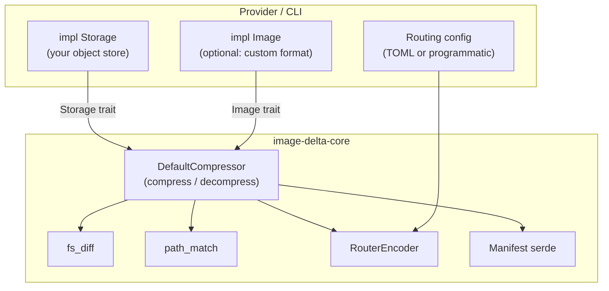

# Responsibility Split

imgdelta is designed so that a cloud provider can embed `image-delta-core`
as a library and supply their own storage backend, without modifying any
algorithm code.

## What `image-delta-core` owns

| Concern                                      | Module                  |
| -------------------------------------------- | ----------------------- |
| Filesystem walk and hash comparison          | `fs_diff`               |
| Path similarity / rename detection           | `path_match`            |
| VCDIFF encoding (xdelta3 FFI)                | `encoding::xdelta3`     |
| Text line-diff encoding (Myers, pure Rust)   | `encoding::text_diff`   |
| Verbatim blob fallback                       | `encoding::passthrough` |
| File-type routing                            | `encoding::router`      |
| Manifest serialisation (MessagePack v4)      | `manifest`              |
| Compress orchestration (8-stage pipeline)    | `compress`              |
| Decompress orchestration                     | `decompress`            |
| Delete orchestration                         | `operations::delete`    |
| `DirectoryImage` (plain directory, no mount) | `image::directory`      |
| `Qcow2Image` (qemu-nbd mount, feature-gated) | `image::qcow2`          |
| `LocalStorage` reference implementation      | `storage::local`        |

## What the provider owns

A provider embedding `image-delta-core` must supply:

1. **`impl Storage`** — connects imgdelta to their own object store and
   metadata index. This is the primary integration point.
2. **`impl Image`** _(optional)_ — if images use a format other than plain
   directories or qcow2, implement `open()` (and optionally `mount()`).
3. **Routing configuration** — either TOML rules (via the CLI) or a
   programmatic `Vec<Box<dyn RoutingRule>>` passed to
   `RouterEncoder::new(rules, fallback)`.

Everything else — the diff algorithm, VCDIFF FFI, path matching, manifest
format, partition layout, decompression order — is handled by the library.

## Trait boundaries

<!-- TODO: turn this into a proper SVG -->

## Why `compress` and `decompress` are free functions

imgdelta deliberately **does not** expose compression as a method on `Image`
(e.g. `image.compress_from(base, storage)`).

Reasons:

- Compression is a heavy, multi-variable operation. The parameters include
  the image format, partition scheme, filesystem types, storage backend,
  routing configuration, worker count, debug options, and passthrough
  threshold. A method signature cannot express this without introducing a
  large options struct anyway.
- Making it a free function with explicit arguments (`compress(image_format,
storage, router, source_root, target_root, options)`) makes the dependency
  on each component visible at the call site.
- It also means `Image`, `Storage`, and `PatchEncoder` remain narrow,
  single-responsibility traits with no cross-trait dependencies.

## Provider integration example

See the [Provider Integration](integration.md) chapter for a complete Rust
example showing how to instantiate and call `compress` / `decompress` with a
custom `Storage` implementation.
